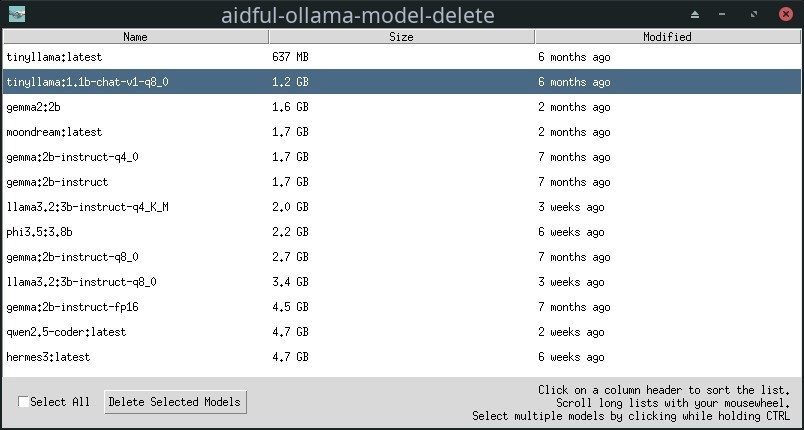

# aidful-ollama-model-delete
A simple GUI tool to manage and delete multiple Ollama models efficiently.

## Description

aidful-ollama-model-delete provides a user-friendly interface to view and delete Ollama models installed on your system. It streamlines the process of managing your Ollama models by allowing batch deletion, saving time and effort.



## Features

- Lists all installed Ollama models with their ID, size, and modification date
- Allows multi-selection of models for deletion
- Simple one-click deletion of selected models
- Utilizes Ollama CLI commands for reliable operation

## Prerequisites

- Ollama must be installed on your system
- Python 3.x

## Installation

1. Clone this repository:
   ```
   git clone https://github.com/yourusername/aidful-ollama-model-delete.git
   ```

## Usage

1. Run the application:
   ```
   cd aidful-ollama-model-delete
   python aidful-ollama-model-delete.py
   ```
2. The GUI will display a list of all installed Ollama models (you can use the mousewheel to scroll through large lists of models and click on column headers to change the sorting of the model view).
3. Select the models you wish to delete by clicking on them while holding the CTRL key.
4. Click the "Delete Selected Models" button to remove the selected models.

## How It Works

The application uses the following Ollama CLI commands:
- `ollama list` to retrieve the list of installed models
- `ollama rm <model1> <model2> ...` to delete the selected models

## Disclaimer

This tool is provided as-is. While care has been taken in its development, the user assumes full responsibility for any unintended deletions or modifications. Please use with caution and ensure you've selected the correct models before deletion.

## Contributing

Contributions, issues, and feature requests are welcome.

## License

[MIT](LICENSE)

## Acknowledgments

This tool is built to work with [Ollama](https://github.com/jmorganca/ollama)
